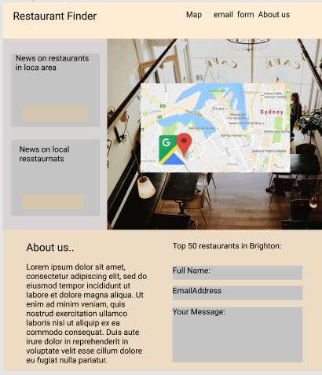
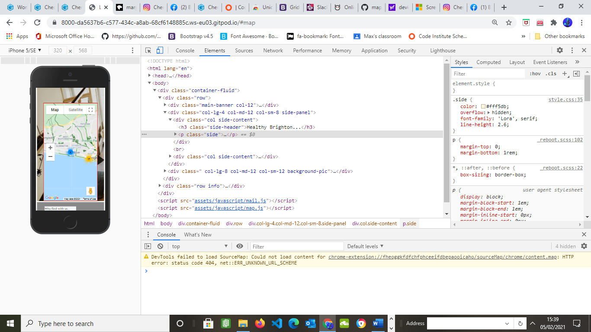
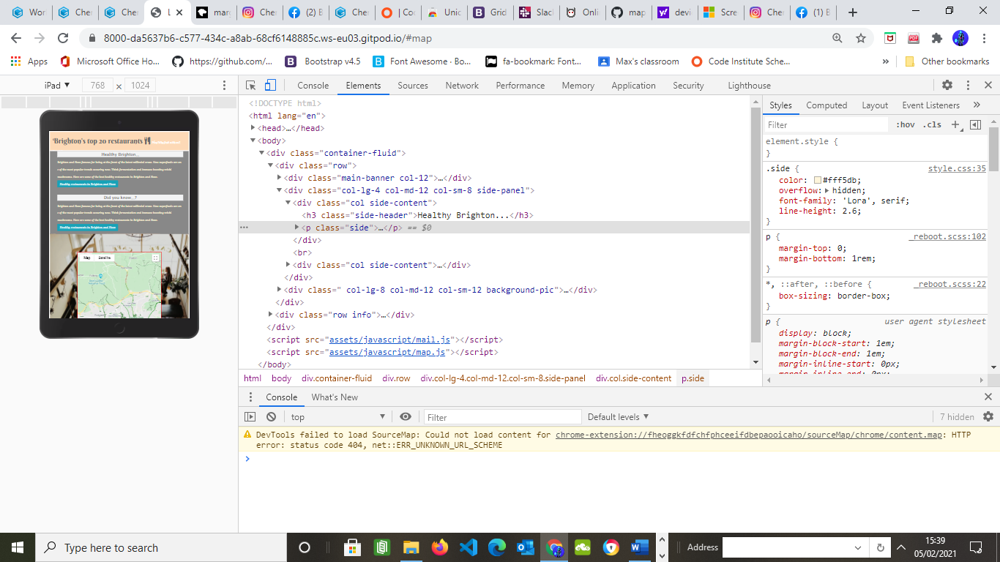

># *Top 20 Restaurants In Brighton And Hove*

 ## **Introduction**
------------------------

This website offers information about the top 20 restaurants in **Brighton and Hove**. 
Being famous as a tourist town with many visitors everyday, most of whom want to find and visit the exceptional restaurants that Brighton and Hove have to offer. 

This website offers a guide to finding restaurants, and offer relevent information needed to make the right decision on which restaurant to visit. 
The information the user can retreive from this site is price range, cuisine, ratings, address and a link to each restaurants website all accessed on a local map with markers. 
This information is delivered through a map that showcases the location of each restaurant, local to Brighton and Hove.
Each restaurant has a marker with an information window to show the features of that particular restaurant.

 ## **Goals**

 

 The goal of this website is to offer a quick and functional way for users to search for the top 20 restaurants in Brighton and Hove. 
 Top 20 restaurants in Brighton and Hove are focused on central Brighton and Hove to support tourists and locals in finding a restaurant that is either close to a hotel they are staying,
 or close to other attractions that Brighton and Hove have to offer. 

Interaction goals for this website are included to support the user in accessing relevent information quickly and easily.
Along with offering the right information in making a decision about a restaurant to visit.

## **Groups**

  Groups        | Names
  ------------- | -------------
  Group 1       | Tourists
  Group 2       | Restaurant Enthusiasts

The groups of people this website supports are varied based on their connection to Brighton and Hove. 
Tourists are the first group this website is targeting, this is becasuse the main element of the site is a map that allows a user to see the locations of the top 20 restaurants on a map. 
This allows this user to find the distance of a restaurant from other attractions and locations they may visit, such as hotels.

Restaurant enthusiasts are another group this website supports. Whether this group lives in Brighton and Hove or are visiting from out of town, 
this website offers a list of exceptional restaurants, features about the restaurant and up to date information on the trends and news associated with the restaurant industry in Brighton and Hove.

#### **Tourists**

 * This group are looking for clear information about the best restaurants to visit in a particular city. 
   The top information that this group look for are location information, addresses to allow each to find the restaurants easily, price range and cuisine.
   Tourists need clear information about a cities best features such as restaurants, this group are looking to access this information easily through one website.

#### **Restaurant Enthusiasts**

* This group may already have knowledge on Brighton and Hove but are looking for information on the best up to date restaurants. Features such as rating, 
  cuisine, trends and news associated with Brighton and Hove restaurant industry, are what this group look for. 
  Restaurant enthusiasts may not be local to Brighton and Hove and might be intersted in discovering more about the the top 20 restaurants in Brighton and Hove based on the reputation the city has.

## **User Stories**

1. I am a tourist on holiday in Brighton and Hove and i want to find a website that shows me the best restaurants in the city. 
I want the website to show me where the restaurant is on a map with information on price ranges, address, cuisine, rating and name.

2. I am a restaurant enthusiasts that is looking for a website that showcases the top 20 restaurants in Brighton and Hove. I want the website to offer relevent information about the trends and news associated with the restaurant scene.

3. I am looking for a website that offers information on the locations of the best restaurants in Brighton and Hove, easily viewed on a map that is close by to other city attractions.

4. I am a restaurant lover who wants to find a website that offer a wide range of top restaurants. With a wide range of prices and cuisines.

## **Fonts** 

The fonts used in this project have been carefully considered to allow the users experience to be similar to 
other websites with the similar target audiences. 

-  Berkshire Swash, cursive
-  Stylish, sans-serif
-  Lora, serif

## **Colours**

 - #fdd9b6 (Pastal Peach)  
 - #888888 (Dark-grey)
 - #676767 (Dark-grey)
 - #fff5db (Pastel peach)
 - #ffffff (White)
 - #f2f3f4 (Pastel Peach)

## **Design**

The design of this website is considered in relation to user readability and ease of use. 
The layout has been produced to ensure that the most relevent information in relation to user stories is evident 
as soon as a user lands on the page. At the top of the page is the main header that explains what the website is showcasing, 
below on the left hand side is information on food trends and news in Brighton, enticing the user to read on. 

To the right of the information is a map that shows central Brighton and Hove The map has markers located at the top 20 resturants 
in the area with information windows that explain details regarding the restaurant and experience. 

Below the map and information area is a text area explaining why the user should use this service when sourcing
a restaurant they want to eat at.

## *Figma*

## *Technologies* 

* HTML
* CSS
* Javascript
* Bootstrap
* Google Maps API

## *Tools* 

* Gitpod 
* Git 
* Figma 
* W3 CSS Validator 
* Chrome Dev tools 
* Font Awesome Icon
* Google Fonts 
* Stackoverflow 
* Code Camp
* Google Maps API
* Google Maps documentation 
* EmailJs

### *Tools EXT*

- Github
- Gitpod 
- Dev Tools 
- Figma 
- W3 CSS Validator 

### *Commands*
 
 * git add
 * git commit -m 'message'
 * git push origin master
 * git status 
 * python -m http.server 

### *Testing*

* In the top banner, testing was done to ensure that the page links, link to the area of the page that it suggets. 
  The links are in place to ensure users viewing on a mobile devices are aware there is a map available to them as well as further information on the website.

* On the right side of the page below the banner is information on food trends in Brighton and Hove with a link to a website that gives
them more information on trends. This shows to be working well, and opens in a new window when clicked.

* The map was tested in realtion to markers:
**ERROR WAS FOUND** -  An error occured during testing and two markers were found to be not opening out of their clusters.
This has since been rectified. The error showed the same longitude and latitude coordinates for both restaurants, now changed to having the correct coordinates. 

* Social media icons are located under information about 'Why find with us'. These show to be connecting to the right webpage and both are opening in a new page.

* Email form was tested, all desired mail is recieved to the users email they input when they fill the form out.
An email will be received by the user giving further information on the top restaurants in Brighton and Hove. 
**CHANGE** - a change was made on the form to the alert box message as it showed a message saying 'message sent' although only the button was clicked.

* Testing was done on responsiveness and found to be working all device sizes.

* *W3* validator was used on both html and css and found no errors.
run website 
* Javascript validator was use to test code structure 

* Lighthouse was used to test performance. A *SLOW* performance was suggested which was rectified when using a different network to 

### *UX and User stories*

Testing was done to evaluate user experience against user stories.

#### *Tourist of Brighton and Hove*
 Reaching the website, at the top of the page is the title that explains the purpose of this website. 
 There is a large map centered in Brighton and Hove with 20 markers on the map located close together. Clicking on a marker will 
 show details about the name, address, rating, price range and website of the restaurant so this user is able to find the correct resaurant 
 they want or need based on their choosing criteria. 
 To the left of the map is information on the trends and news associated food culture in Brighton and Hove, allowing the user to become inspired and prompting a decision 
 to attend one of the chosen restaurants on the map. 

 At the bottom of the page is information on 'why they should source with us' and to the right of that is a form that the user is able to place their name and email to recieve 
 an email on further information on the top 20 restaurants in Brighton and Hove. 

 A bike lane layer is added to support decision making on how to get to a restaurant 

 #### *Restaurant Enthusiasts*
On the intial landing on the page this user is able to see from the title that they are able to find the top
restaurants in Brighton aand Hove. At the top of the page are links to areas on the page they might like to view. 
On the left side is some information on the latest trends and news associated with Brighton and Hove restaurants.
To the right hand side is a map, local to Brighton and Hove with markers showing the location of the restaurant.
A email form is avaiable if this user would like more information to hand to help with their decision making.

### **Deployment**

* Log into GitHub.
* Go to repositories choose map.
* Go to settings.
* Go down to GitHub Pages.
* Click on master branch.
* Go down to GitHub Pages and click on the provided link.
  
### **Special thanks**

Aaron Sinnot - Mentor 
Miklos - Tutor support 
Slack 
Student Care - Alexander 

         

 

